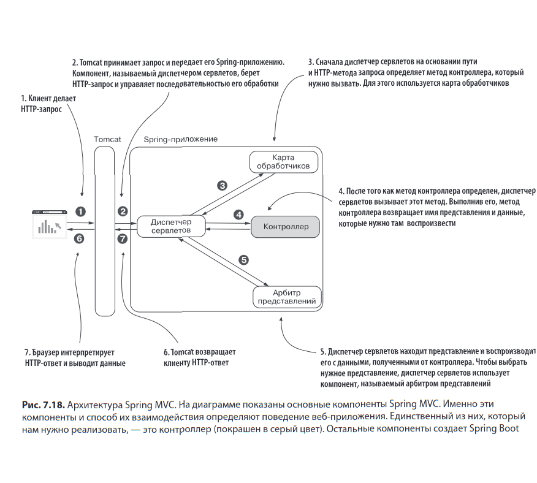

# Простейшее приложение на SpringBoot
Раздел 7.2, стр. 199.<br>
Чтобы отметить класс как контроллер Spring MVC, применяется
стереотипная аннотация @Controller, а чтобы связать действие контроллера
с определенным HTTP-запросом — аннотация @RequestMapping.

В этом примере Spring обработает http-запрос по адресу http://localhost:8080/home и вернет view `home.html`.
```java
@Controller
public class FirstappApplicationController {
    @RequestMapping("/home")
    public String home() {
        return "home.html";
    }
```


Контейнер сервлетов - еще называют веб-сервер. В java это обычно Tomcat. <br>
Диспетчер сервлетов - единая точка входа в приложение SpringBoot, в диспетчер Tomcat передает http-запрос от клиента.<br>
Поскольку Spring Boot автоматически генерирует конфигурацию компонентов Spring MVC и контейнера сервлетов, для организации простейшего обмена запросами и ответами HTTP разработчику остается только написать
HTML-документ, который веб-приложение передаст клиенту, и класс контроллера.

