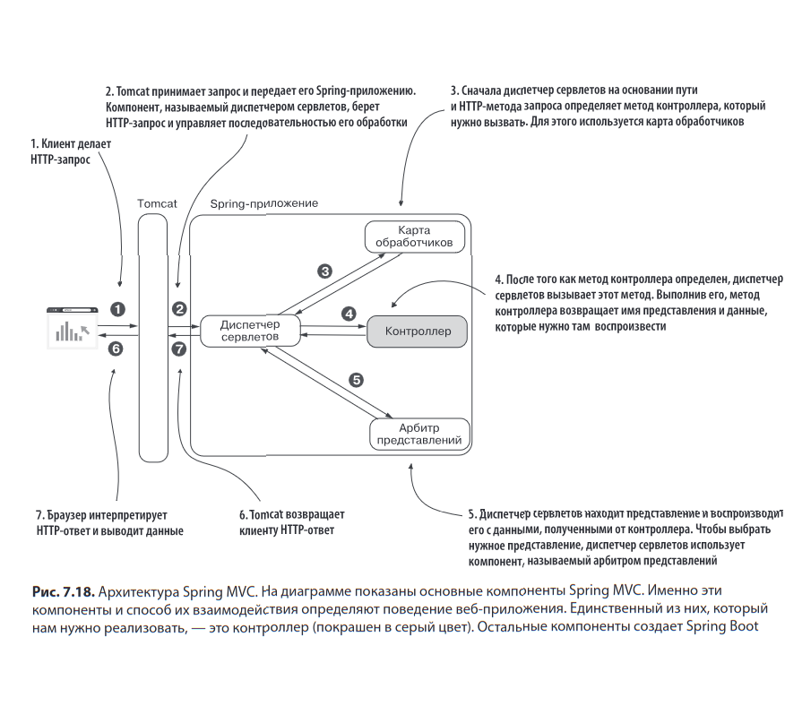

# Простейшее приложение на SpringBoot
Раздел 7.2, стр. 199. 
Чтобы отметить класс как контроллер Spring MVC, применяется
стереотипная аннотация @Controller, а чтобы связать действие контроллера
с определенным HTTP-запросом — аннотация @RequestMapping.

Контейнер сервлетов - еще называют веб-сервер. В java это обычно Tomcat.  
Диспетчер сервлетов - единая точка входа в приложение SpringBoot, в диспетчер Tomcat передает http-запрос от клиента. 
Поскольку Spring Boot автоматически генерирует конфигурацию компонентов Spring MVC и контейнера сервлетов, для организации простейшего обмена запросами и ответами HTTP разработчику остается только написать
HTML-документ, который веб-приложение передаст клиенту, и класс контроллера.

