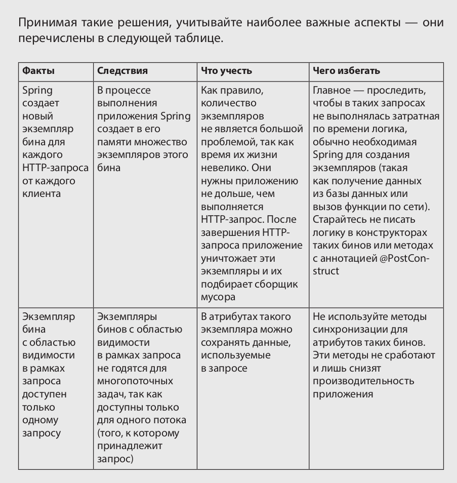

# @RequestScope - бин с областью видимости в рамках http-запроса
Эта аннотация используется, когда экземпляр класса должен храниться в памяти только на время http-запроса.
Применяется для аутентификации.

@RequestScope - потокобезопасен, тк этот бин доступен только одному http-запросу. Spring гарантирует, что экземпляр бина с областью видимости в рамках запроса доступен только для данного HTTP-запроса.

```java
// LoginProcessor.java
@Component  // bean
@RequestScope  // scope
public class LoginProcessor {
    private String username;
    private String password;


    public boolean login() {
        String username = this.getUsername();
        String password = this.getPassword();

        if ("natalie".equals(username) && "password".equals(password)) {
            return true;
        } else {
            return false;
        }
    }

// LoginController.java
@Controller  //bean
public class LoginController {
    private LoginProcessor loginProcessor;
    // DI with constructor
    public LoginController(LoginProcessor loginProcessor) {
        this.loginProcessor = loginProcessor;
    }

    @GetMapping("/")
    public String loginGet() {
        return "login.html";
    }

    @PostMapping("/")  // http-request
    public String loginPost(@RequestParam String username, @RequestParam String password,
            Model model) {
        // экземпляр loginProcessor будет удален из контекста и подобран сборщиком мусора
        // после выполнения loginPost http-запроса
        loginProcessor.setUsername(username);
        loginProcessor.setPassword(password);
        boolean isLogin = loginProcessor.login();

        if (isLogin) {
            model.addAttribute("message", "You are now logged in.");
        } else {
            model.addAttribute("message", "Login failed!");
        }

        return "login.html";
    }


}
```

```html
<!DOCTYPE html>
<html lang="en" xmlns:th="http://www.thymeleaf.org">
<head>
    <meta charset="UTF-8">
    <title>Login</title>
</head>
<body>
    <form action="/" method="post">
        Username: <input type="text" name="username" /><br />
        Password: <input type="password" name="password" /><br />
        <button type="submit">Log in</button>
    </form>

    <p th:text="${message}"></p>
</body>
</html>
```


### Про @RequestScope
