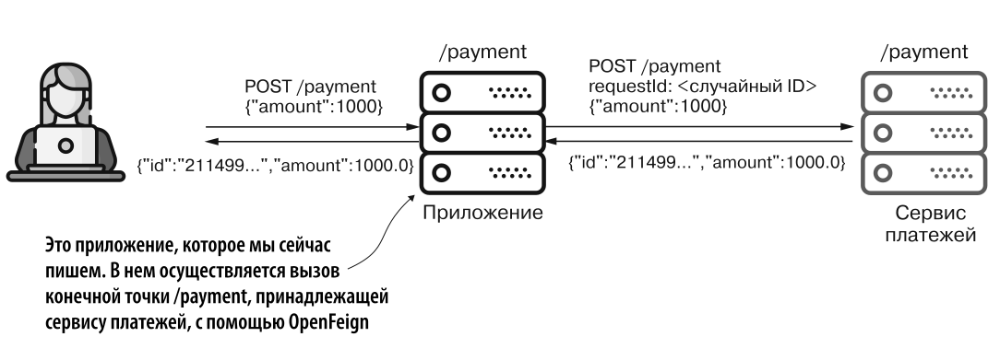

# Сервис платежей
Приложение используется как api для приложения `feingclient`.

Запустить оба приложения:
`payment_service` и `feignclient`.<br>
Вызвать в консоли:
```bash
curl -X POST -H 'content-type:application/json' -d '{"amount":1000}' http://localhost:9090/payment
```
Запрос уйдет в `feignclient`, а `feignclient` переадресует этот запрос в `payment_service`, как будто один сервис спрашивает данные у другого сервиса и возвращает ответ клиенту.

На скрине приложение - `feignclient`.<br>
Сервис платежей - этот проект.
