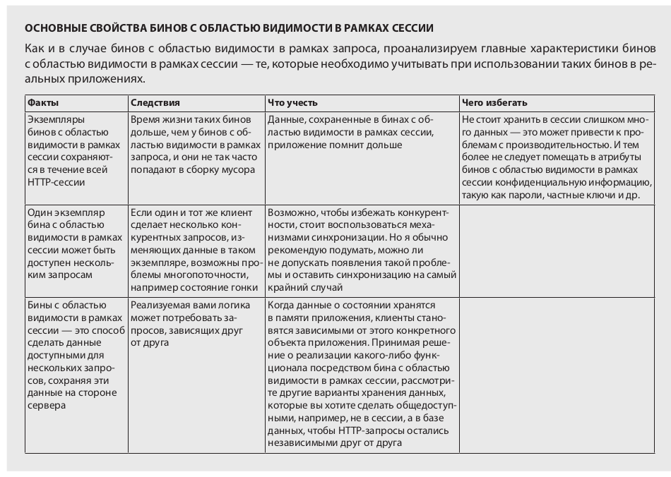

# @SessionScope - бин, с областью видимостью на уровне сессии
Этот бин доступен всем http-запросам, использующих эту сессию.

@SessionScope - непотокобезопасен, надо синхронизировать, тк хотя доступ к этому бину имеет только 1 клиент, он может отправлять конкурентные http-запросы изменяющие данные в этом бине, что приведет к состоянию гонки.


В примере этот скоуп используется для сохранения username пользователя во время аутентификации.
Пока длится сессия клиента, бин созданный с аннотацией @SessionScope - доступен.
Этот бин используется в LoginProcessor.java для сохранения пользователя на время сессии.
Так же он используется в MainController.java для подстановки имени и выхода из системы.
```java
@Service
@SessionScope
public class LoggedUserManagementService {

  private String username;

  public String getUsername() {
    return username;
  }

  public void setUsername(String username) {
    this.username = username;
  }
}

// LoginProcessor
@Component
@RequestScope
public class LoginProcessor {
    private String username;
    private String password;
    private LoggedUserManagementService loggedUserManagementService;

    public LoginProcessor(LoggedUserManagementService loggedUserManagementService) {
        this.loggedUserManagementService = loggedUserManagementService;
    }

    public boolean login() {
        String username = this.getUsername();
        String password = this.getPassword();

        boolean loginResult = false;
        if ("natalie".equals(username) && "password".equals(password)) {
            loginResult = true;
            loggedUserManagementService.setUsername(username);
        }

        return loginResult;
    }

// MainController
@Controller
public class MainController {
    private final LoggedUserManagementService loggedUserManagementService;

    public MainController(LoggedUserManagementService loggedUserManagementService) {
        this.loggedUserManagementService = loggedUserManagementService;
    }

    @GetMapping("/main")
    public String home(@RequestParam(required = false) String logout, Model model) {
        if (logout != null) {
            loggedUserManagementService.setUsername(null);
        }

        String username = loggedUserManagementService.getUsername();
        if (username == null) {
            return "redirect:/";
        }

        model.addAttribute("username", username);
        return "main.html";
    }
}
```
### SessiopScope
