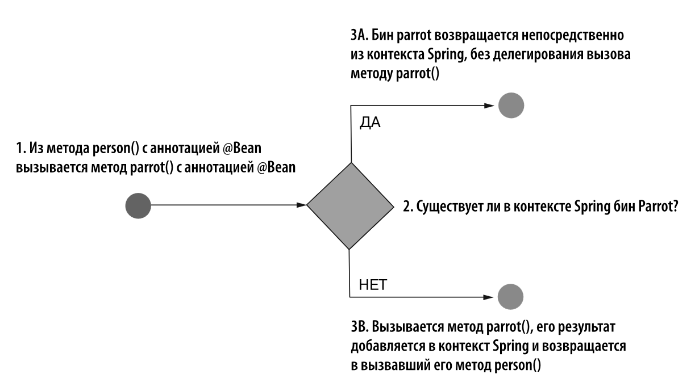

# Wiring - метод прямого монтажа бина.

#### Монтаж бинов путем прямого вызова одного метода с аннотацией @Bean из другого такого же метода
Бин должен быть определен с помощью аннотации @Bean.

Стр 85 - 87.<br>
Устанавливаем связь между бинами путем прямого монтажа. (wiring)
Данный способ подразумевает вызов метода (parrot()), возвращающего бин, с которым
устанавливается прямая связь.
Этот метод нужно вызывать из другого метода ( из person() ) —
определяющего бин, для которого устанавливается зависимость.

Если в контексте уже есть бин parrot, то вместо того, чтобы вызвать метод
parrot(), Spring сразу извлекает этот экземпляр из контекста.<br>
Если же бин parrot в контексте еще не создан, то Spring вызывает метод parrot() и возвращает созданный бин.
```java
package ru.poltoranin.config;

import org.springframework.context.annotation.Bean;
import org.springframework.context.annotation.Configuration;

import ru.poltoranin.beans.Parrot;
import ru.poltoranin.beans.Person;

@Configuration
public class ProjectConfig {

    @Bean
    Person person() {
        Person person = new Person();
        person.setName("Bob");
        person.setParrot(parrot()); //wiring - прямой монтаж бина parrot в бин person.
        return person;
    }

    @Bean
    Parrot parrot() {
        Parrot parrot = new Parrot();
        parrot.setName("Abu");
        return parrot;
    }
}
```
<details>
<summary>Пояснение</summary>

</details>


#### Монтаж бинов путем передачи параметра в метод с аннотацией @Bean
Не имеет значения, как был определен бин, на который мы ссылаемся: с помощью
аннотации @Bean или посредством стереотипной аннотации наподобие @Component.
```java
package ru.poltoranin.config;

import org.springframework.context.annotation.Bean;
import org.springframework.context.annotation.Configuration;

import ru.poltoranin.beans.Parrot;
import ru.poltoranin.beans.Person;

@Configuration
public class ProjectConfig {

    @Bean
    Person person(Parrot parrot) { //wiring in params - Монтаж бина через передачу в параметре.
        Person person = new Person();
        person.setName("Bob");
        person.setParrot(parrot);
        return person;
    }

    @Bean
    Parrot parrot() {
        Parrot parrot = new Parrot();
        parrot.setName("Abu");
        return parrot;
    }
}
```
